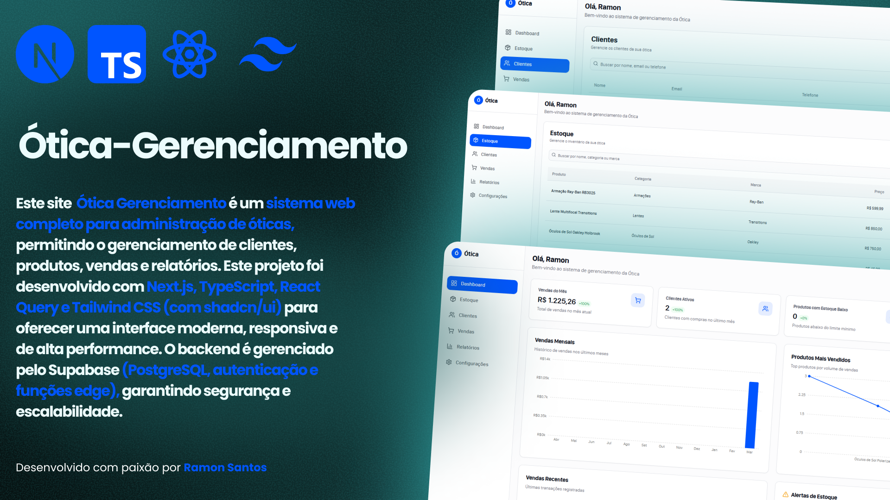

# Ótica Gerenciamento



O **Ótica Gerenciamento** é um sistema web completo para administração de óticas, permitindo o gerenciamento de clientes, produtos, vendas e relatórios. Este projeto foi desenvolvido com Next.js, TypeScript, React Query e Tailwind CSS (com shadcn/ui) para oferecer uma interface moderna, responsiva e de alta performance. O backend é gerenciado pelo Supabase (PostgreSQL, autenticação e funções edge), garantindo segurança e escalabilidade.

**Site:** [https://otica-gerenciamento.vercel.app](https://otica-gerenciamento.vercel.app)  
**Repositório:** [GitHub - RamonSantos9/otica-gerenciamento](https://github.com/RamonSantos9/otica-gerenciamento)

## 1. Visão Geral

O **Ótica Gerenciamento** foi criado para otimizar processos operacionais de uma ótica, oferecendo controle sobre vendas, estoque, cadastro de clientes e geração de relatórios. Seu principal objetivo é melhorar a tomada de decisão por meio de análises detalhadas e assegurar a integridade e segurança dos dados. O sistema integra diversas funcionalidades essenciais, desde o cadastro de clientes até a emissão de extratos financeiros em PDF.
Este repositório contém um sistema web completo para gerenciamento de óticas, incluindo administração de vendas, estoque, clientes e relatórios. Ótica Gerenciamento foi desenvolvido para fins de estudo e experimentação, demonstrando conceitos modernos de desenvolvimento web, integração com banco de dados e boas práticas de arquitetura.

## 2. Descrição

O Ótica Gerenciamento visa otimizar processos de venda e administração de uma ótica. Nele, você pode cadastrar produtos, controlar estoque, registrar vendas e gerar relatórios. Apesar de ter sido criado como um projeto de estudos, ele apresenta uma arquitetura robusta e escalável, servindo de base para quem deseja aprender e expandir funcionalidades de um sistema de gestão.

## Principais Objetivos

Gerenciamento de Clientes: Cadastrar e manter dados de clientes, acompanhar histórico de compras e total gasto.
Administração de Estoque: Monitorar produtos, ajustar quantidades, receber alertas de estoque baixo.
Registro de Vendas: Registrar transações, aplicar métodos de pagamento e acompanhar status (pendente, completo, cancelado).
Relatórios Personalizados: Gerar PDFs com informações de vendas em períodos específicos e totalizar valores.
Tecnologias Utilizadas
Next.js / React / TypeScript:
Arquitetura de frontend moderna para construção de interfaces reativas e escaláveis.
Tailwind CSS (shadcn/ui):
Framework de estilização para criação de layouts responsivos e componentes reutilizáveis.
React Query (Tanstack):
Gerenciamento de dados e cache, facilitando requisições e sincronização com o backend.
Supabase (PostgreSQL + Auth + Edge Functions):
Banco de dados relacional e serviços de autenticação. Permite integração rápida e segura.
ESLint & Prettier:
Ferramentas para manter a padronização e qualidade do código.
Vercel:
Plataforma de hospedagem que integra facilmente com projetos Next.js para deploy contínuo.
Funcionalidades
Cadastro de Clientes:
Armazene dados como nome, email, telefone, endereço e total gasto.
Gerenciamento de Produtos:
Registre armações, lentes e óculos de sol, definindo preço, marca, estoque e limiar de reposição.
Registro de Vendas:
Selecione o cliente, defina a data, método de pagamento e status. Calcule o valor total e associe itens da venda.
Relatórios em PDF:
Selecione período (mês ou intervalos pré-definidos) e exporte dados detalhados das vendas em formato PDF.
Busca e Filtros:
Localize rapidamente vendas por cliente, número, método de pagamento e status.
Configurações e Perfil:
Atualize informações de perfil, configure preferências de notificação e gerencie o tema (claro/escuro).
Instalação e Uso
Siga as etapas abaixo para rodar o projeto localmente:

1.  **Clone o repositório:**

```bash
git clone https://github.com/RamonSantos9/otica-gerenciamento.git

```

2.  **Entre na pasta do projeto:**

    ```bash
    cd otica-gerenciamento

    ```

3.  Crie um arquivo .env na raiz do projeto e adicione a seguinte linha:

    ```bash
    VITE_SUPABASE_URL="https://<seu-projeto>.supabase.co"
    VITE_SUPABASE_ANON_KEY="<sua-chave-anon>"

    ```

4.  **Instale as dependências**

        npm install

5.  **Inicie o servidor de desenvolvimento**

    ```bash
    npm run dev

    ```

6.  **Acesse o projeto: Abra seu navegador e digite**

    ```bash
    http://localhost:3000 ou http://localhost:8080
    ```

7.  **Deploy na Vercel**

Conecte seu repositório GitHub ao Vercel.
Configure as variáveis de ambiente no painel da Vercel (mesmas do .env.local).
A cada push na branch principal, o Vercel fará o build e deploy automáticos.
Observações Importantes
Segurança:
Nunca compartilhe chaves sensíveis em repositórios públicos. Mantenha variáveis de ambiente fora do versionamento (adicione .env.local ao seu .gitignore).
Projeto para Estudos:
Este sistema foi desenvolvido com foco em aprendizado e demonstração de conceitos. Caso queira usar em produção, revise autenticação, segurança, backups e escalabilidade.

9. **Contribuições:**

Sinta-se livre para abrir issues ou enviar pull requests. Feedbacks, correções e novas ideias são sempre bem-vindos.
Licença
Este projeto está licenciado sob a MIT License - veja o arquivo LICENSE para mais detalhes.

## **Contato**

**Autor: Ramon Santos** |
**Demonstração:** [https://otica-gerenciamento.vercel.app](https://otica-gerenciamento.vercel.app)
